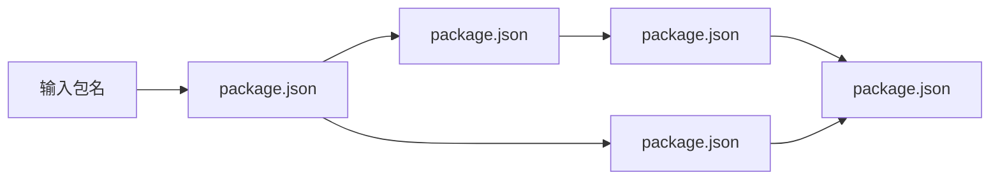
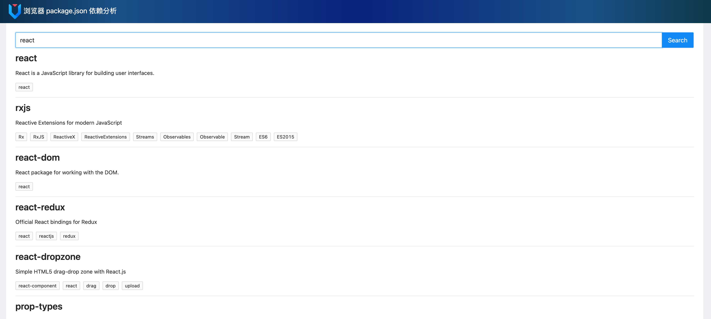
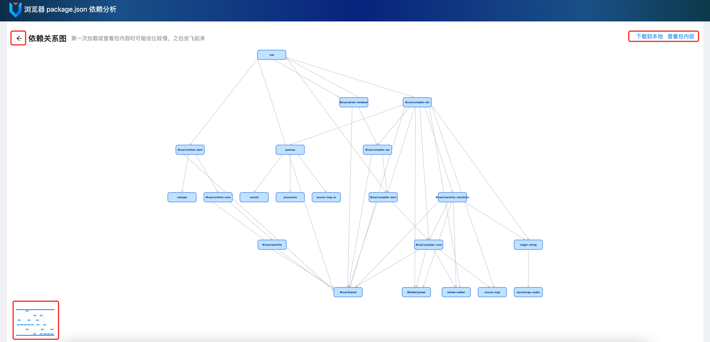
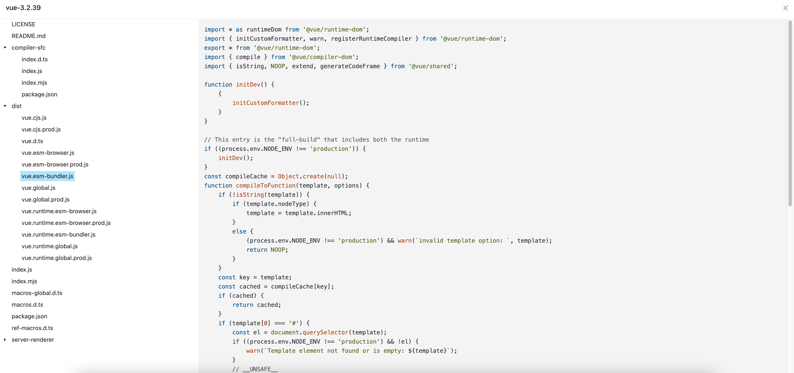

# 浏览器 package.json 依赖分析

## 背景
由于网络环境问题(如内网)提供给用户的服务，可能不能穿透;但用户浏览器往往是可以跨网络环境的

## 任务
#### 模拟的场景：搜索npm包，查看包的依赖关系图，在线查看包的文件内容，并提供包下载到本地功能
#### 流程图

## 动作
- 调研npm的api接口：纯浏览器解析，要支持跨域请求
  - [npm官方文档](https://docs.npmjs.com/cli/v8/using-npm/registry)
  - [官方支持](https://www.npmjs.com/support)
- 调研包的解压与下载
  - tgz文件的解析
  - [npm库搜索](https://www.npmjs.com/search?q=gzip)
- 调研绘制依赖图的可视化方案
  - [Dagre](https://github.com/dagrejs/dagre)
  - [D3.js](https://github.com/d3/d3)
  - [Mermaid.js](https://github.com/mermaid-js/mermaid)
  - [Sigma.js](https://www.sigmajs.org/)
  - [AntV G6](https://antv-2018.alipay.com/zh-cn/g6/3.x/index.html)

## 结果
### 选型与实现
- 调用的npm接口
  - [发起的提问](https://github.com/npm/feedback/discussions/766)
  - [已归档的关于registry endpoints/API的文档](https://github.com/npm/registry)
  - [查询包信息接口](https://github.com/npm/registry/blob/master/docs/REGISTRY-API.md#getpackage)
- 包下载后是压缩后的gzip文件，查看内容时先要进行ungzip、再untar
  - pako.ungzip
  - js-untar
- 缓存优化二次访问性能
  - 包依赖的结构数据放入localStorage
  - 包文件内容数据放入indexDB
- 绘制依赖图的可视化方案选型
  - Dagre是绘制流程图的底层库，主要是用来计算图的元素布局，使用它再结合图形库，如D3、Mermaid，就能实现一个绘制流程图的图可视化库，G6的Dagre流程图布局也是基于它
  - D3.js数据驱动框架，提供了大量诸如地理、几何、布局、时间、行为等等API，可灵活绘制的图表、关系图和流程图等各种图形，但自然也足够复杂
  - Mermaid.js量级更轻，主要是以声明的方式来绘制各种流程图，但功能相对简单
  - Sigma.js的功能丰富，实现的图可视化不仅类型更多，还能包含复杂的用户交互效果
  - AntV G6：与Sigma.js类似，阿里的图可视化解决方案
    - 有落地实践经验
    - 功能强大，流程布局可满足功能要求
    - 易维护，有配套的中文文档
  
### 页面预览
- 
- 
- 

### 未完待续